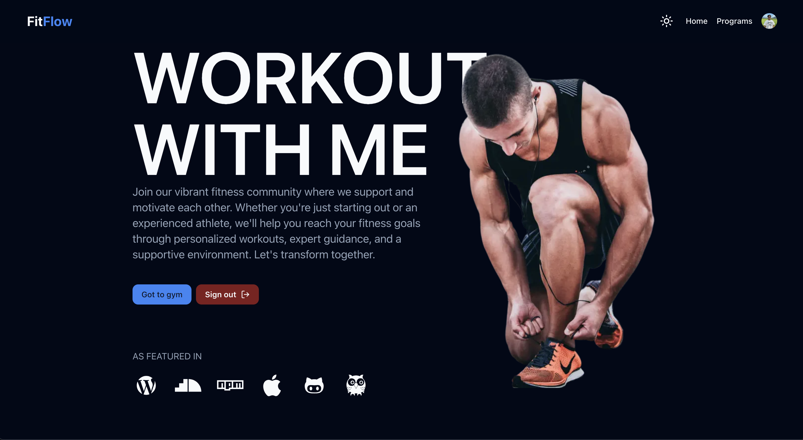

FitFlow is a modern and responsive workout gym website designed to help users track their fitness journey, set goals, and stay motivated. Built with cutting-edge technologies, FitFlow delivers a seamless experience for fitness enthusiasts of all levels. 

## 📸 Screenshots  
### **Home Page:** 
 

### 🚀 Features:
- **Intuitive User Interface:** Clean, modern design powered by **Next.js**, **Tailwind CSS**, and **React** for a responsive experience across all devices.
- **User Authentication:** Secure user authentication using **Clerk**, allowing users to easily sign up and log in with their preferred method.
- **Real-Time Data Management:** Powered by **Firebase**, FitFlow provides real-time updates to workouts, goals, and progress.
- **TypeScript:** Ensures type safety and improves code quality for a robust, maintainable project.

### 💻 Technologies Used:
- **Frontend:** 
  - **Next.js** (for server-side rendering and static site generation)
  - **React.js** (for building UI components)
  - **Tailwind CSS** (for utility-first CSS framework)
  - **TypeScript** (for static typing and enhanced developer experience)
  
- **Backend:**
  - **Firebase** (for authentication, real-time database, and cloud functions)
  
- **Authentication:** 
  - **Clerk** (secure authentication for user management)

### ⚙️ Features to Explore:
- **Workout Tracking:** Log your workouts and monitor your progress over time.
- **Goal Setting:** Set personal fitness goals and track your achievements.
- **Real-Time Sync:** Get real-time updates on your progress with Firebase integration.
- **Authentication:** Use **Clerk** for secure and easy user login/signup.

### 🌱 How to Contribute:
1. Fork this repository
2. Create your feature branch (`git checkout -b feature-name`)
3. Commit your changes (`git commit -m 'Add feature'`)
4. Push to the branch (`git push origin feature-name`)
5. Create a new Pull Request

### 🔧 Contact:
For any questions, suggestions, or improvements, feel free to open an issue or contact me directly.
